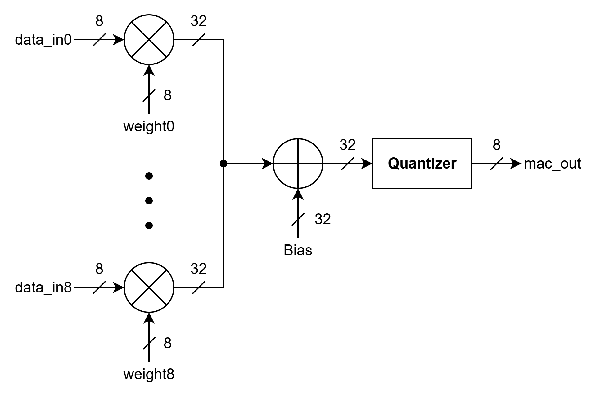

# 개발 일지 — 2026-07-13

> 프로젝트명: `CNN 가속기 설계 프로젝트`  
> 작성자: `김동현`  
> 태그: `#STM32F411`

---

## 1. 오늘의 목표
<!-- 작업 시작 전, 오늘 하려던 것을 적습니다 -->
- [x] STM32 기본 사용법 학습
- [x] STM32 기반 GPIO제어
- [ ] STM32 Timer 제어
- [ ] STM32 Interrupt 제어
- [x] MAC Core 설계

---

## 2. 수행 내용
<!-- 실제로 한 작업과 '왜 그렇게 했는지'를 함께 적습니다 -->

### 2.1 작업 내용
*STM32 기본 학습*

*STM32의 GPIO를 통한 LED제어*

*MAC Core 유닛 설계*
- AI 기본 연산인 Multiply & Accumulate 연산 유닛 설계
- Basys3의 부족한 자원을 아껴서 쓰기 위해 Weight는 8bit로 설계
- Weight는 $2^\text{-n}$으로 scaling되어 이후 Quantizer에서 다시 scaling
- Quantizer 제외 연산 결과의 경우 데이터 손실이 일어나지 않도록 32bit로 연산 수행

<!-- PDF 변환 시 줄 나누기 용도 -->

### 2.2 자료
<!-- 이미지는 같은 폴더의 images/ 안에 두고 아래처럼 링크합니다 -->

*Mac Core*

---

## 3. 문제 및 디버깅
<!-- 포트폴리오에서 가장 중요한 부분. 사고의 흐름을 남깁니다 -->

---

## 4. 결과 및 진척도
- 완료한 목표: 
  1. 기본 사용법 학습 및 GPIO 제어
  2. MAC Core 공부 및 설계도 그리기 완료
- 진행 중: 
- 보류: 

---

## 5. 다음 할 일
- [ ] Basys3로 CNN 가속기 설계한 논문 학습
- [ ] CNN 연산 로직 공부

---

## 6. 메모 / 떠오른 생각
<!-- 의문점, 아이디어, 다음에 시도해볼 것 -->
- 곱 연산의 경우 critical path로 작용하여 setup violation을 야기할 가능성이 있음
- 이후 negative slack 발생 시 accumulator와 bias 연산기 사이에 stage 추가

## 참고 자료
1. [AnOptimised CNN Hardware Accelerator Applicable to IoT End](../paper/AnOptimised%20CNN%20Hardware%20Accelerator%20Applicable%20to%20IoT%20End.pdf)  