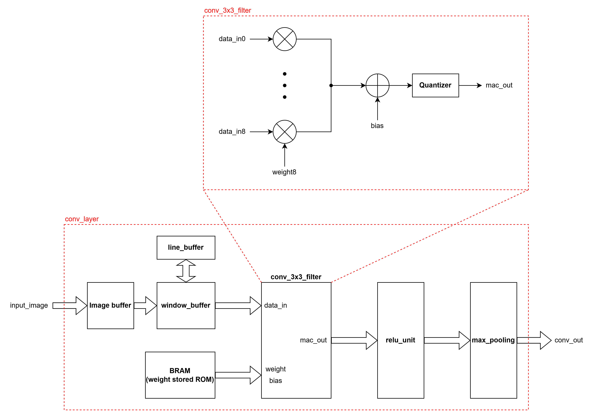
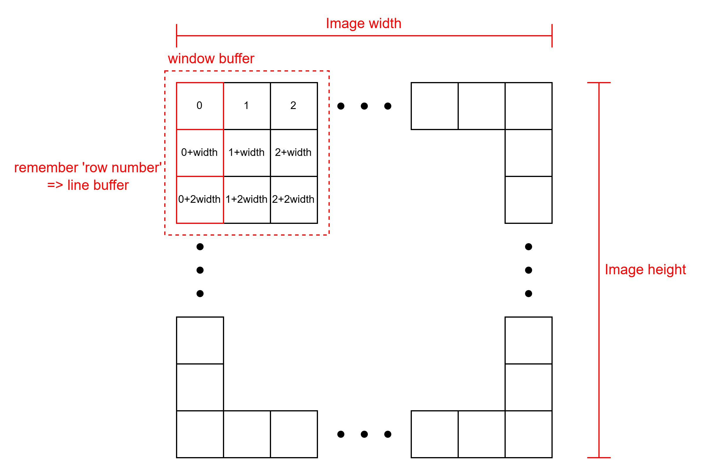

# 개발 일지 — 2026-07-14

> 프로젝트명: `CNN 가속기 설계 프로젝트`  
> 작성자: `김동현`  
> 태그: `#CNN` `#Basys3`

---

## 1. 오늘의 목표
<!-- 작업 시작 전, 오늘 하려던 것을 적습니다 -->
- [ ] CNN 연산 로직 공부 
- [x] Basys3로 CNN 가속기 설계한 논문 학습  
- [x] 논문 바탕으로 아이디어 구성

---

## 2. 수행 내용
<!-- 실제로 한 작업과 '왜 그렇게 했는지'를 함께 적습니다 -->

### 2.1 작업 내용

*Convolution layer 설계*
1. MAC 연산
   - 연산량을 줄이기 위해 weight는 8bit로 설계
   - 데이터 연산 과정에서 손실을 방지하기 위해 multi 결과는 32bit로 저장
   - 이후 다음 layer 혹은 연산에서도 8bit로 연산하기 위해 정보를 축소하는 Quantizer 사용  
2. Line Buffer
   - 한 convolution layer에서 filter의 weight는 동일하다는 점을 이용해 입력 데이터를 바꿀 수 있는 line_buffer 설계
   - row number를 image의 width에 따라서 설정하고, line buffer는 이 행 위치를 저장
   - conv filter의 경우 3x3 크기로 설정  

<!-- PDF 변환 시 줄 나누기 용도 -->

### 2.2 자료
<!-- 이미지는 같은 폴더의 images/ 안에 두고 아래처럼 링크합니다 -->

*Conv layer module*

*Line Buffer concept*

---

## 3. 문제 및 디버깅
<!-- 포트폴리오에서 가장 중요한 부분. 사고의 흐름을 남깁니다 -->

---

## 4. 결과 및 진척도
- 완료한 목표: 
  1. Convolution 연산 용 layer 설계
  2. 이미지 전달을 위한 Line buffer 개념 이해
- 진행 중: 
  1. CNN에 관한 지식을 더 단단히 해야 함
  2. max_pooling 연산 유닛 설계
- 보류: 

---

## 5. 다음 할 일
- [ ] BRAM기반 max_pooling연산을 위한 memory controller 설계
- [ ] tensorflow 학습 및 이를 바탕으로 하는 CNN 코드 작성

---

## 6. 메모 / 떠오른 생각
<!-- 의문점, 아이디어, 다음에 시도해볼 것 -->
- max_pooling의 경우 BRAM을 베이스로 하여 Memory controller 설계를 이에 맞게 해야 함