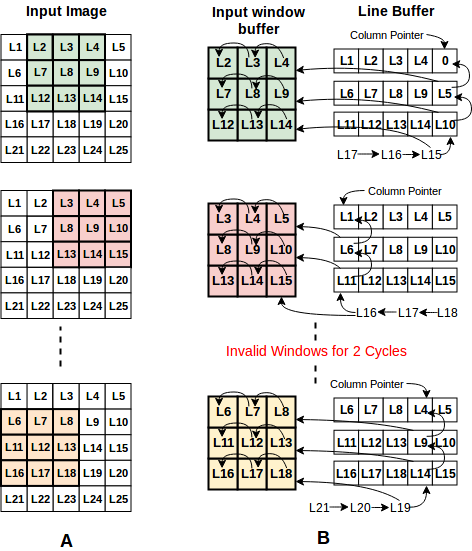

# 개발 일지 — 2026-07-16

> 프로젝트명: `CNN 가속기 설계 프로젝트`  
> 작성자: `김동현`  
> 태그: `#STM32` `#CNN` `#C`

---

## 1. 오늘의 목표
<!-- 작업 시작 전, 오늘 하려던 것을 적습니다 -->
- [x] STM32의 UART제어
- [x] RS232통신 이해
- [ ] Timer 제어 및 Interrupt 제어
- [x] Lenet5 Python 코드 작성 및 학습
- [x] C 코드로 Golden Reference 작성

---

## 2. 수행 내용
<!-- 실제로 한 작업과 '왜 그렇게 했는지'를 함께 적습니다 -->

### 2.1 작업 내용

*STM32*
- STM32기반 SysTick 제어 및 UART 통신 제어

*Lenet5 기반 Python 코드 작성*
- Lenet5를 기반으로 하여 CNN 네트워크 코드 작성
- 다만 기존의 Lenet5는 사용할 데이터 셋인 MNIST를 적용하기에 불필요하게 무거운 부분이 있음
- 그래서 FC는 120-84-10의 흐름을 가져가고 Convolution layer는 2 stage만 동작
- 하드웨어에서 Convolution 연산량을 줄이기 위해 Max pooling을 2x2 kernel에 stride 1으로 설정
- 하드웨어에서는 연산량을 줄이기 위해 Int8을 사용하기에 이에 맞춰 weight 및 bias를 양자화

*C - line buffer*
- 가속기의 경우 verilog 전에 c 혹은 python으로 golden reference를 제작한다는 것을 알게 되어 이를 선행
- 기존에 계획한 image buffer와 line buffer를 동시에 사용하는 구조의 경우 불필요한 BRAM을 사용한다는 것 확인
- line buffer는 Convolution 연산에 필요한 Kernel 사이즈 만큼의 행을 받는 순간부터 연산이 가능하다는 점에서 더 빠른 연산이 가능

### 2.2 자료
<!-- 이미지는 같은 폴더의 images/ 안에 두고 아래처럼 링크합니다 -->

  
*Line Buffer 개념*  

```c
void line_buf_push(uint8_t img_data_in)
{
    // first row
    win[0] = win[1];
    win[1] = win[2];
    win[2] = lb0[col_cnt];
    
    // second row
    win[3] = win[4];
    win[4] = win[5];
    win[5] = lb1[col_cnt];

    // last row
    win[6] = win[7];
    win[7] = win[8];
    win[8] = img_data_in;

    // Update line buffer
    lb0[col_cnt] = lb1[col_cnt];
    lb1[col_cnt] = img_data_in;

    // Make valid signal to check data is available
    lb_valid = (row_cnt >= KERNEL_SIZE-1) && (col_cnt >= KERNEL_SIZE-1);

    // Column count
    col_cnt++;
    if (col_cnt == IMG_WIDTH)
    {
        col_cnt = 0;
        row_cnt++;
    }
}
```  
*Line Buffer C코드*

---


## 3. 문제 및 디버깅
<!-- 포트폴리오에서 가장 중요한 부분. 사고의 흐름을 남깁니다 -->


---

## 4. 결과 및 진척도
- 완료한 목표: 
  1. STM32에서 UART 및 SysTick 동작 제어 완료
  2. 하드웨어에 적용할 Lenet5 신경망 작성 완료
  3. Convolution 연산을 위한 line buffer에 대한 이해 및 Golden Reference(C) 구현 완료
- 진행 중: 
- 보류: 

---

## 5. 다음 할 일
- [ ] Line buffer 코드 리팩토링
- [ ] Convolution 연산 및 Max pooling 연산 C 구현

---

## 6. 메모 / 떠오른 생각
<!-- 의문점, 아이디어, 다음에 시도해볼 것 -->
- Convolution 연산을 위한 line buffer를 이해하니 max pooling에서도 동일한 개념을 사용하였음을 이해