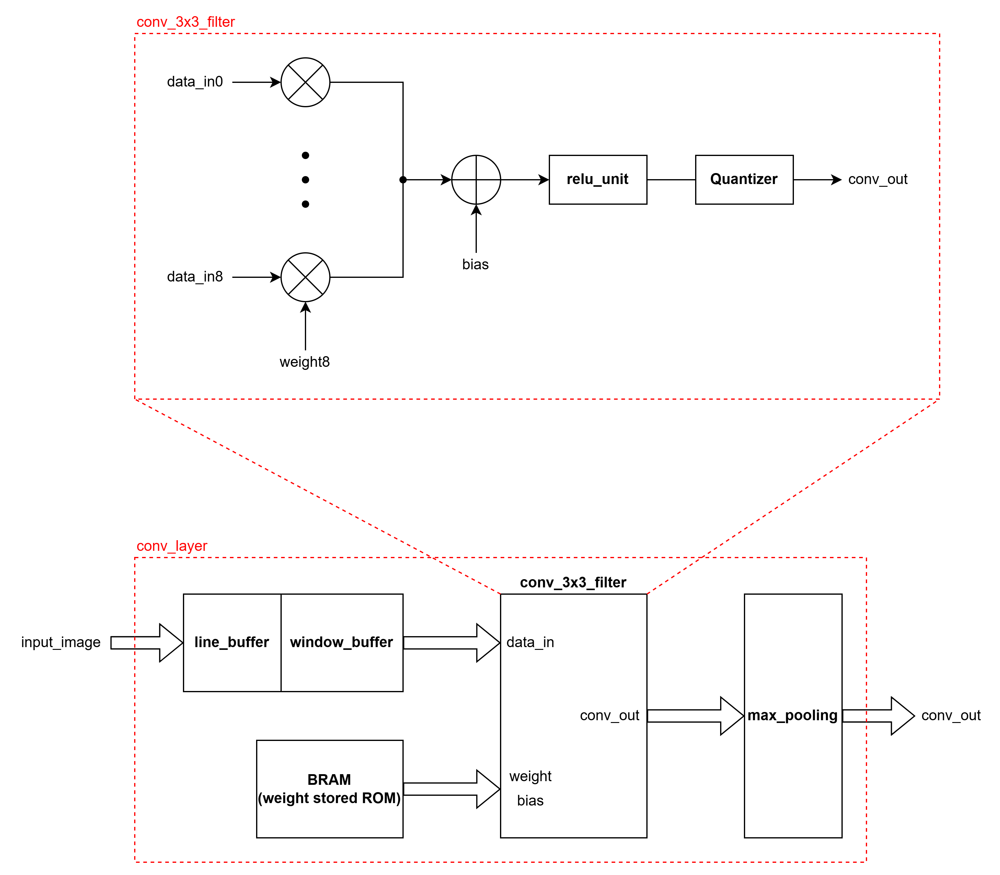

# 개발 일지 — 2026-07-18

> 프로젝트명: `CNN 가속기 설계 프로젝트`  
> 작성자: `김동현`  
> 태그: `#CNN` `#C`

---

## 1. 오늘의 목표
<!-- 작업 시작 전, 오늘 하려던 것을 적습니다 -->
- [ ] Convolution 연산 및 Max pooling 연산 C 구현

---

## 2. 수행 내용
<!-- 실제로 한 작업과 '왜 그렇게 했는지'를 함께 적습니다 -->

### 2.1 작업 내용

*Convolution 연산 및 ReLU Fn 구현 완료*
- 출력을 signed int8로 수행시, -128 ~ 127의 데이터 밖에 표현할 수 없는 것 확인
- ReLU Activation function이 clamp 동작을 수행하는 것을 이용하여 0 ~ 255의 데이터를 표현할 수 있도록 설계
- scale factor를 8로 하여 유의미한 연산 값이 나올 수 있도록 설정 (weight의 scale은 4로 설정)

### 2.2 자료
<!-- 이미지는 같은 폴더의 images/ 안에 두고 아래처럼 링크합니다 -->

*수정한 Convolution Layer*

---

## 3. 문제 및 디버깅
<!-- 포트폴리오에서 가장 중요한 부분. 사고의 흐름을 남깁니다 -->
### 문제 #1
- **증상**: conv 연산 결과가 0 혹은 127로 고정이 되는 현상 발생
- **확인 과정**: 
  1. Line buffer의 window 출력이 정상적으로 반영되지 않았을 상황을 가정해 확인
  2. 이에 따라 연산 값이 정상적으로 수행되는지 확인
- **원인**: weight scale factor와 requantize 과정에서 scale factor의 곱을 1로 설정했더니 출력이 매우 크게 발생하는 것 확인
- **해결**: requantize의 scale factor를 4->8로 조정하여 연산이 수행되는 것을 확인

---

## 4. 결과 및 진척도
- 완료한 목표: 
- 진행 중: 
- 보류: 

---

## 5. 다음 할 일

---

## 6. 메모 / 떠오른 생각
<!-- 의문점, 아이디어, 다음에 시도해볼 것 -->